Simple Killing Floor 2 Server Launcher 
===============================================================

Aplicación que permite fácilmente personalizar y lanzar un servidor de Killing Floor 2 a través de una interfaz visual en lugar de editar ficheros batch o de configuración del servidor. Desarrollado con Autoplay Media Studio 8.

```
Versión: 1.3.2
Última fecha modificación: 18/05/2018
S.O. soportado: Microsoft Windows
Autor: César Rodríguez González
Idioma: Inglés, Español
```

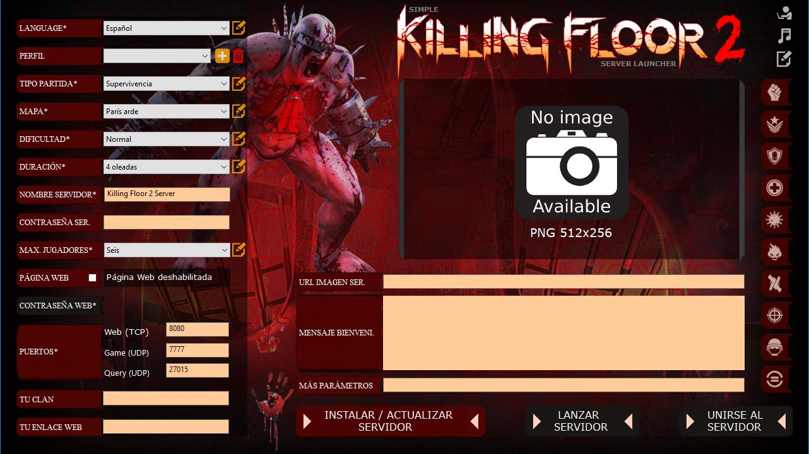

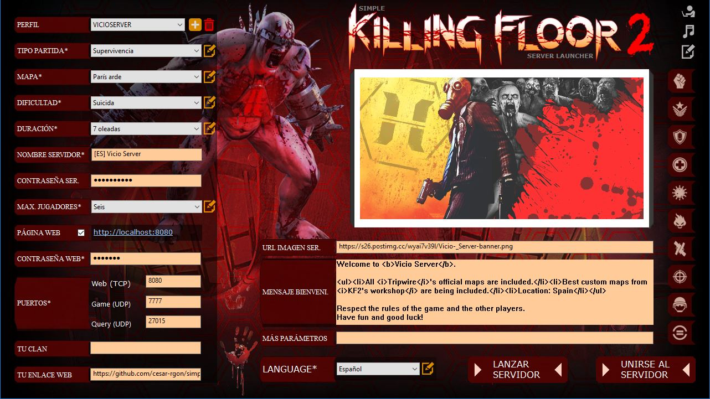

El fichero "Simple-KF2server-launcher.zip" contiene los ficheros binarios para ejecutar la aplicación. Descarga sólo este fichero si sólamente necesitas usar la aplicación.

El fichero "Simple-KF2server-launcher.apz" es el proyecto fuente (necesita ser editado con Autoplay Media Studio si quieres hacer cambios en él). Descarga este fichero sólamente si necesitas editar el proyecto de la aplicación.

##### Índice
> 1. [Pre-requisitos](#pre-requisitos)
> 2. [Instalar y ejecutar el lanzador](#instalar-y-ejecutar-el-lanzador)
> 3. [Entendiendo el lanzador](#entendiendo-el-lanzador)
> 4. [Anexo](#anexo)
>   - [A1. Agregar o eliminar un mapa personalizado del lanzador y servidor](#a1-agregar-o-eliminar-un-mapa-personalizado-del-lanzador-y-servidor)
>   - [A2. Agregar el tipo de juego *Dificultad Controlada* al lanzador](#a2-agregar-el-tipo-de-juego-dificultad-controlada-al-lanzador)
>   - [A3. Argumentos de línea de comandos](#a3-argumentos-de-línea-de-comandos)
>   - [A4. Cómo ejecutar más de un servidor KF2 en el mismo ordenador](#a4-cómo-ejecutar-más-de-un-servidor-kf2-en-el-mismo-ordenador)
>   - [A5. Reproducir música cuando el lanzador es ejecutado](#a5-reproducir-música-cuando-el-lanzador-es-ejecutado)


### Pre-requisitos
- Conexión a internet para descargar, actualizar y/o publicar un servidor Killing Floor 2.
- Abrir los puertos necesarios en el router y firewall si quieres que el servidor sea visible desde internet. Los puertos necesarios se muestran [aquí][kf2serverPorts].

### Instalar y ejecutar el lanzador
- Descargar el fichero binario desde [aquí][binary-launcher].

> CASO 1: Si NO tienes una instalación previa de servidor de Killing Floor 2:
- Extraer el contenido del fichero Simple-KF2server-launcher.zip a una carpeta local cualquiera.
- Crear un acceso directo en tu escritorio al fichero "autorun.exe".
- Ejecutar el acceso directo.
- Instalar un servidor Killing Floor 2 pulsando el botón "Instalar / Actualizar servidor" en el lanzador.

> CASO 2: Si tienes una instalación previa de servidor de Killing Floor 2:
- Extraer el contenido del fichero Simple-KF2server-launcher.zip en la carpeta raíz del servidor Killing Floor 2.
- Crear un acceso directo en tu escritorio al fichero "autorun.exe".
- Ejecutar el acceso directo.

### Entendiendo el lanzador
**Idioma**: Este campo es obligatorio. Para administrar (añadir/modificar/borrar) la lista de Idiomas, pulsa en el icono amarillo situado al lado del elemento combo (esto es análogo a editar el fichero de texto: AutoPlay\Docs\Language.properties). Al menos debe existir un idioma.

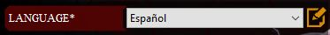

**Perfil**: Este campo es opcional. Permite guardar los valores de campos (valores de filtros) por perfil. Si no hay perfil seleccionado, los campos no pueden ser guardados. Puedes agregar un nuevo perfil o eliminar uno seleccionado.

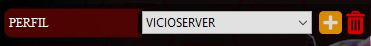

**Tipo de juego**: Este campo es obligatorio. Para administrar (añadir/modificar/borrar) los Tipos de Partida, pulsa en el icono amarillo situado al lado del elemento combo (esto es análogo a editar el fichero de texto: AutoPlay\Docs\es\GameTypes.properties). Al menos debe existir un tipo de juego.

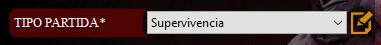

**Mapa**: Este campo es obligatorio. Para administrar (añadir/modificar/borrar) la lista de Mapas Propios, pulsa en el icono amarillo situado al lado del elemento combo (esto es análogo a editar el fichero de texto: AutoPlay\Docs\profiles\TUPERFIL\CustomMaps.properties). La lista oficial de mapas no puede ser modificada por el lanzador, debes editar a mano el fichero de texto: AutoPlay\Docs\es\OfficialMaps.properties. Al menos debe existir un mapa.


**Dificultad**: Este campo es obligatorio si el tipo de juego no es igual a Semanal, desactivado en otro caso. Para administrar (añadir/modificar/borrar) la lista de Dificultades, pulsa en el icono amarillo situado al lado del elemento combo (esto es análogo a editar el fichero de texto: AutoPlay\Docs\es\Difficulty.properties). Al menos debe existir un tipo de dificultad.

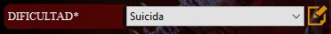

**Duración**: Este campo es obligatorio si el tipo de juego no es igual a Semanal o Sin Fin, desactivado en otro caso. Para administrar (añadir/modificar/borrar) la lista de Duraciones, pulsa en el icono amarillo situado al lado del elemento combo (esto es análogo a editar el fichero de texto: AutoPlay\Docs\es\Length.properties). Al menos debe existir un tipo de duración.

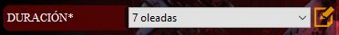

**Nombre servidor**: Este campo es obligatorio. Debe contener al menos un caracter.

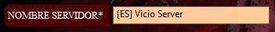

**Contraseña servidor**: Este campo es opcional.

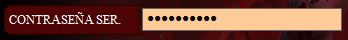

**Max. jugadores**: Este campo es obligatorio. Para administrar (añadir/modificar/borrar) los Jugadores Máximos, pulsa en el icono amarillo situado al lado del elemento combo (esto es análogo a editar el fichero de texto: AutoPlay\Docs\es\MaxPlayers.properties o AutoPlay\Docs\es\MaxPlayersVersus.properties). Al menos debe existir una cifra de máx.jugadores.

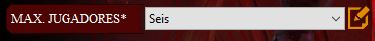

**Página Web administración**: Si la página web está habilitada, se puede gestionar el servidor mediante ésta. El servidor Killing Floor 2 debe estar iniciando antes de que puedas acceder a la página web. La contraseña Web es obligatoria sólo si la página web está habilitada. Autenticación:
```
Usuario: admin
Contraseña: <Contraseña Web>
```

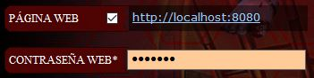

**Puertos**: Los Puertos son obligatorios. Necesitas abrir los puertos en tu router y firewall. Si se inicia más de un servidor, los puertos deben ser diferente entre ellos (un perfil por configuración de servidor).

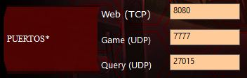

**Tu clan**: Este campo es opcional.

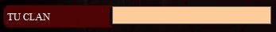

**Tu enlace web**: Este campo es opcional.

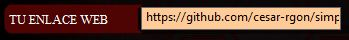

**URL imágen del servidor**: Este campo es opcional. El enlace debe devolver una imágen subida a internet que será usada como una preview en el servidor Killing Floor 2. El formato y resolución debe ser PNG 512x256 pixeles.


**Mensaje bienvenida**: Este campo es opcional. Es un mensaje de bienvenida en la pantalla de inicio del servidor.

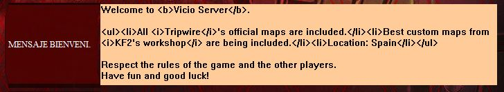

**Más parámetros**: Este campo es opcional. Define parámetros adicionales. El formato es: parametro1=valor1?parametro2=valor2?...?parametroN=valorN

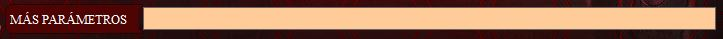

**Instalar servidor**: Instala un nuevo servidor de Killing Floor 2 o bien actualiza uno existente mediante la aplicación SteamCmd. Puedes actualizar a versiones oficiales o betas.

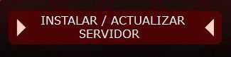

**Lanzar servidor**: Inicia un servidor Killing Floor 2 con los filtros especificados. Todos los campos obligatorios deben ser especificados. Si no hay perfil, los ficheros de configuración del servidor están localizados en la carpeta: KFGame\Config\\\_NoneProfile. Si se selecciona un perfil, los ficheros de configuración del servidor están localizados en la carpeta: KFGame\Config\\\PROFILENAME. De esta forma, los ficheros de configuración originales localizados en la carpeta: KFGame\Config nunca son modificados.


**Unirse al servidor**: Te unes a la partida de un servidor de Killing Floor 2 iniciado previamente. Si el servidor no ha sido iniciado, entrará al juego pero se quedará en el menú principal del mismo. Pre-requisitos: Tener instalados Steam y juego Killing Floor 2. Si no se especifica puerto de Juego (UDP) no podrá unirse al servidor. Si el servidor tiene contraseña y no se ha especificado la contraseña, no podrá unirse al mismo.

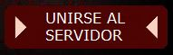

**Icono para editar ficheros PCServer-KFEngine.ini y PCServer-KFGame.ini**: Enlace que permite editar los dos ficheros principales de configuración de un servidor Killing Floor 2. Útil para revisar la configuración del servidor.


**Icono para abrir carpeta música**: Enlace que abre la carpeta de música del lanzador de servidor de Killing Floor 2. Si se agregan ficheros de música a la carpeta, el lanzador las reproducirá, automáticamente, en bucle y aleatoriamente.


**Icono sobre el autor**: Enlace a pantalla con información de la versión y autor del lanzador.


### Anexo
#### A1. Agregar o eliminar un mapa personalizado del lanzador y servidor
##### Pre-requisitos
* Haber creado un perfil del lanzador.

##### Agragar un mapa personalizado al lanzador
Si añades mapas personalizados al lanzador entonces el lanzador añadirá automáticamente el mapa al servidor de Killing Floor 2 (sin necesidad de editar ningún fichero de configuración).

Para agregar mapas personalizados al lanzador, sigue los siguientes pasos:

1) Pulsa en el icono amarillo situado al lado del elemento combo de mapa (esto es análogo a editar el fichero de texto: "AutoPlay\Docs\profiles\TUPERFIL\CustomMaps.properties").


2) En la ventada de edición de texto agrega líneas al final del fichero con el siguiente formato:
```
KF-NombreMapa[?idMapa]=Descripción Mapa
```
* [  ] significa: opcional.
* KF-NombreMapa: Obligatorio. Debe ser igual al nombre de fichero del mapa sin extensión.
* idMapa: Opcional. Es el identificador de mapa de Steam Workshop.
* Descripción Mapa: Obligatorio. Será mostrado en el combo de mapas (acepta espacios en blanco).

Por ejemplo:
```
KF-BikiniAtoll?643383080=Bikini Atoll
KF-Biolapse?1258411772=Biolapse
KF-ClubConfession?1215467327=Club Confession
KF-Corridor?1208883070=Corridor
KF-Farm?960186191=Farm
KF-HorzineArena-B1-v5?711621345=Horzine Arena
KF-IceArena?642421282=Ice Arena
KF-londonRevamp?643152606=London Revamp
KF-Arid_Zedlands?1285074158=Arid Zedlands!
```


El lanzador modificará automáticamente estos archivos:
* KFGame\Config\TUPERFIL\PCServer-KFEngine.ini: Añadiendo una línea por mapa (sólamente para aquellos mapas en los que se ha definido ?idMap). Esta acción descargará los mapas cuando el servidor sea lanzado.
* KFGame\Config\TUPERFIL\PCServer-KFGame.ini: Añadiendo varias líneas por mapa. Esta acción agregará los mapas al como de mapas de la página web del servidor.

##### Eliminar un mapa personalizado del lanzador
Si eliminas un mapa personalizado del lanzador entonces el lanzador automáticamente eliminará el mapa de los ficheros de configuración del servidor.

Para hacer esta acción:
* Pulsa en el icono amarillo situado al lado del elemento combo de mapa (esto es análogo a editar el fichero de texto: "AutoPlay\Docs\profiles\TUPERFIL\CustomMaps.properties").
* Elimina las líneas adecuadas y guarda los cambios.
* Inicia el servidor y los mapas serán eliminados automáticamente.

#### A2. Agregar el tipo de juego *Dificultad Controlada* al lanzador
##### Pre-requisitos
* Descargar el fichero "ControlledDifficulty.u" de [ésta][controlled-difficulty-realeases] página web.
* Copiar el fichero "ControlledDifficulty.u" a la carpeta "<KF2-Server-Root\>\KFGame\BrewedPC\Script\" tal como se explica en [ésta][controlled-difficulty-server] página web.

##### Agregar el tipo de juego *Dificultad Controlada* al lanzador
Pulsa en el icono amarillo situado al lado del elemento combo de tipo de juego (esto es análogo a editar el fichero de texto: "AutoPlay\Docs\es\GameTypes.properties")


y añade la siguiente línea al final del fichero:
```
ControlledDifficulty.CD_Survival=Dificultad Controlada
```

Opcionalmente, añade parámetros adicionales en la sección "Más parámetros". Los parámetros disponibles para el mod *Dificultad Controlada* están descritos en [ésta][controlled-difficulty-options] página web.

Por ejemplo:
```
MaxMonsters=32?WaveSizeFakes=5?SpawnCycle=basic_heavy
```

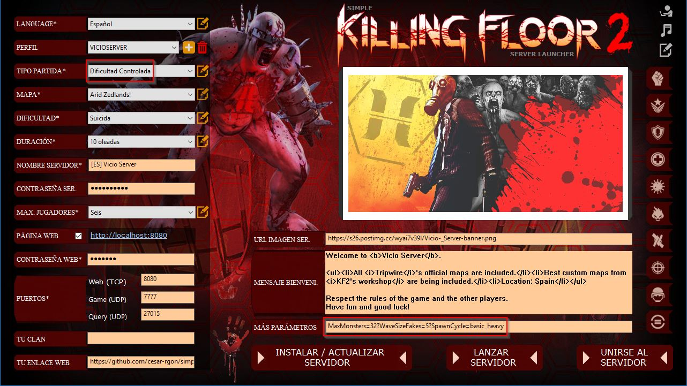

#### A3. Argumentos de línea de comandos
Los argumentos de línea de comandos aceptados son:
 ```
 autorun.exe --profiles PROFILENAME1 {PROFILENAME2 PROFILENAME3 ...}
```
{} significa: Opcional

Cuando especificas estos argumentos, el lanzador no será interactivo, es decir, carga y ejecuta cada perfil automáticamente sin necesidad de interacción por parte del usuario.

Por ejemplo:
```
autorun.exe --profiles MYPROFILE
```
El lanzador, en el arranque, cargará el perfil MYPROFILE y ejecutará el servidor automáticamente.

#### A4. Cómo ejecutar más de un servidor KF2 en el mismo ordenador
Necesitas un perfil por servidor. Cada perfil debería contener un nombre de servidor diferente para ser identificado. Además, cada perfil debe tener diferentes puertos entre ellos.

Por ejemplo: Dos servidores en el mismo ordenador
- PERFIL1: Nombre servidor: Mi Servidor 1; Puertos: 8080, 7777, 27015
- PERFIL2: Nombre servidor: Mi Servidor 2; Puertos: 8081, 7778, 27016

_Pasos (manera interactiva)_:
- Iniciar el lanzador
- Cargar perfil PROFILE1
- Lanzar servidor
- Cargar perfil PROFILE2
- Lanzar servidor

_Pasos (manera no interactiva)_:
- Crear un acceso directo con destino:
```
autorun.exe --profiles PROFILE1 PROFILE2
```
- Ejecutar el acceso directo

#### A5. Reproducir música cuando el lanzador es ejecutado
El lanzador reproducirá, en el inicio, ficheros de música localizados en la carpeta AutoPlay\Music. Los formatos aceptados son: .mp3, .ogg, etc.
La música se reproducirá en orden aleatorio y en bucle.

### Notas del autor
Espero que te sea de utilidad esta aplicación.

Por un jugador para jugadores :)

<!-- References -->
[kf2serverPorts]:https://wiki.tripwireinteractive.com/index.php?title=Dedicated_Server_%28Killing_Floor_2%29#Ports
[binary-launcher]:https://github.com/cesar-rgon/simple-kf2server-launcher/raw/master/Simple-KF2server-launcher.zip
[controlled-difficulty-realeases]:https://github.com/notblackout/kf2-controlled-difficulty/releases
[controlled-difficulty-server]:https://github.com/notblackout/kf2-controlled-difficulty/blob/master/server.md
[controlled-difficulty-options]:https://github.com/notblackout/kf2-controlled-difficulty/blob/master/options.md
