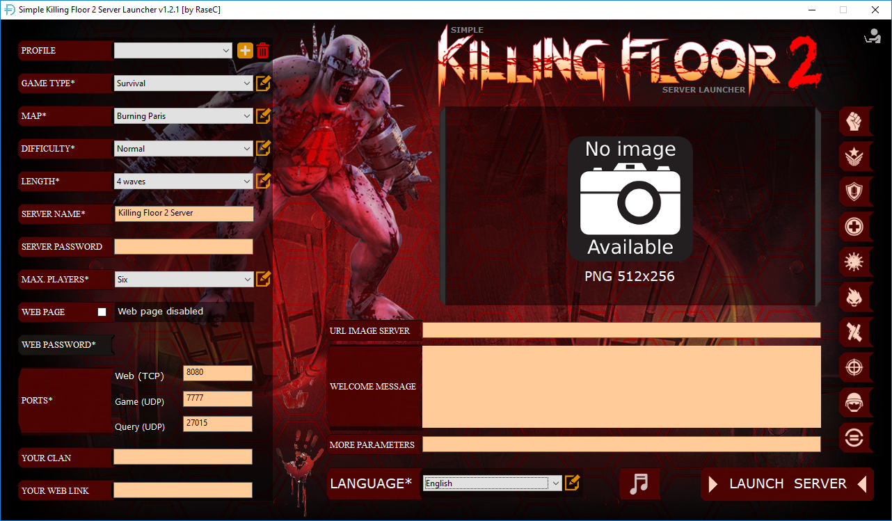
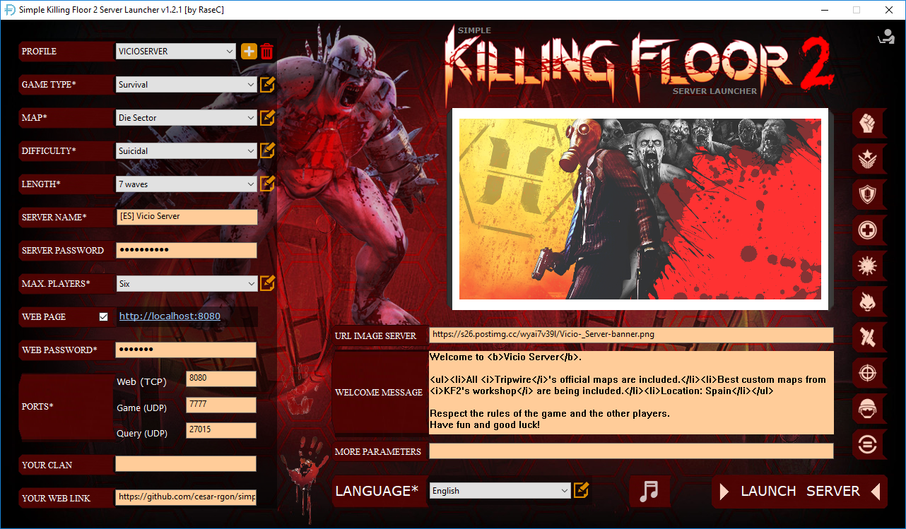

Simple Killing Floor 2 Server Launcher 
===============================================================

Application to easily customize and launch a Killing Floor 2 Server through a visual interface instead of edditing batch files or server's config files. It has been developed with Autoplay Media Studio 8.

The file "Simple-KF2server-launcher.zip" contains binary files to execute the application.

The file "Simple-KF2server-launcher.apz" is the source project (It needs to be edit with Autoplay Media Studio if you want to make changes on it).

```
Version: 1.0
Last modified date: 2018/03/31
Author: César Rodríguez González
Language: English, Spanish
```




### Pre-requisites
- Download and install a Killing Floor 2 Server. Instructions can be found [here](https://wiki.tripwireinteractive.com/index.php?title=Dedicated_Server_%28Killing_Floor_2%29). For this document, we supose that the installation folder is: C:\kf2server (but can be any other).
- Open needed ports in your router and firewall if you want your server be visible on internet.

### Installing and running the launcher
- Download binary file from [here](https://github.com/cesar-rgon/simple-kf2server-launcher/raw/master/Simple-KF2server-launcher.zip).
- Extract the content of the Simple-KF2server-launcher.zip file in your Killing Floor 2 server folder.
For example, the result would be:
```
C:\kf2server\Autoplay
C:\kf2server\autorun.exe
C:\fk2server\icon.ico
C:\kf2server\lua5.1.dll
C:\kf2server\lua51.dll
etc (Files and folders of Killing Floor 2 server)
```
- Create a direct link on your desktop to "autorun.exe" file.
- Execute direct link to "autorun.exe" file.

### Understanding the launcher
Under construction 

### Author notes
I hope you can find useful this application.

By a gamer for gamers :)
