Simple Killing Floor 2 Server Launcher 
===============================================================

Application to easily customize and launch a Killing Floor 2 Server through a visual interface instead of edditing batch files or server's config files. It has been developed with Autoplay Media Studio 8.

```
Version: 1.3.2
Last modification date: 2018/05/18
Supported OS: Microsoft Windows
Author: César Rodríguez González
Language: English, Spanish
```


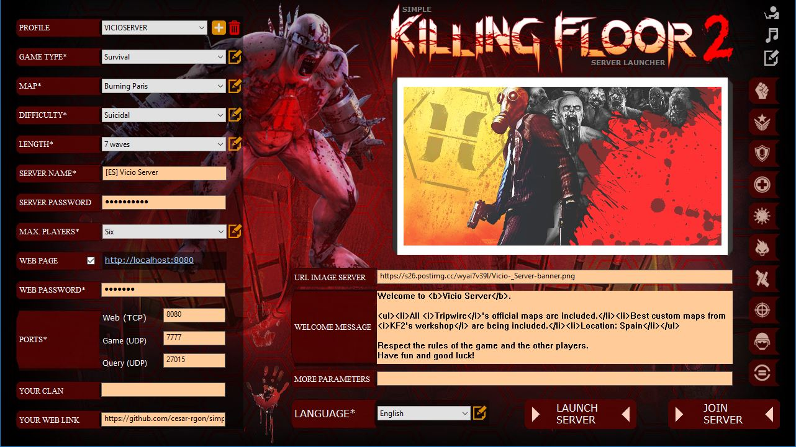

The file "Simple-KF2server-launcher.zip" contains binary files to execute the application. Download only this file to use the application.

The file "Simple-KF2server-launcher.apz" is the source project (It needs to be edit with Autoplay Media Studio if you want to make changes on it). Download this file only if you want to edit application's project.

##### Index
> 1. [Pre-requisites](#pre-requisites)
> 2. [Installing and running the launcher](#installing-and-running-the-launcher)
> 3. [Understanding the launcher](#understanding-the-launcher)
> 4. [Anex](#anex)
>   - [A1. Add or remove a custom map from the launcher and the server](#a1-add-or-remove-a-custom-map-from-the-launcher-and-the-server)
>   - [A2. Add *Controlled Difficulty* game type to the launcher](#a2-add-controlled-difficulty-game-type-to-the-launcher)
>   - [A3. Command line arguments](#a3-command-line-arguments)
>   - [A4. How to execute more than one KF2 server on same computer](#a4-how-to-execute-more-than-one-kf2-server-on-same-computer)
>   - [A5. Play music when the launcher is executed](#a5-play-music-when-the-launcher-is-executed)


### Pre-requisites
- Internet connection to download, update and/or publish a Killing Floor 2 server.
- Open needed ports in your router and firewall if you want your server be visible on internet. Needed ports are shown [here][kf2serverPorts].

### Installing and running the launcher
- Download binary file from [here][binary-launcher].

> CASE 1: If you do NOT have a previous installation of a Killing Floor 2 server:
- Extract the content of the Simple-KF2server-launcher.zip to any local folder.
- Create a direct link on your desktop to "autorun.exe" file.
- Execute direct link to "autorun.exe" file.
- Install a Killing Floor 2 server by clicking the button "Install / Update server" in the launcher.

> CASE 2: If you have a previous installation of a Killing Floor 2 server:
- Extract the content of the Simple-KF2server-launcher.zip file to your server's root folder.
- Create a direct link on your desktop to "autorun.exe" file.
- Execute direct link to "autorun.exe" file.

### Understanding the launcher
**Language**: This field is mandatory. To manage (add/remove/delete) Language list, just click on yellow icon next to combobox item (it is analog to edit text file: AutoPlay\Docs\Language.properties). At least one language must exist.

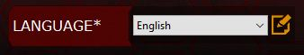

**Profile**: This field is optional. It allows to save field values (filter values) by profile name. If no profile is selected, field values can not be saved. You can add a new profile or delete the selected one.


**Game Type**: This field is mandatory. To manage (add/modify/delete) Game Type list, just click on yellow icon next to combobox item (it is analog to edit text file: AutoPlay\Docs\en\GameTypes.properties). At least one game type must exist.

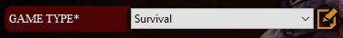

**Map**: This field is mandatory. To manage (add/modify/delete) Custom Map list, just click on yellow icon next to combobox item (it is analog to edit text file: AutoPlay\Docs\profiles\YOURPROFILE\CustomMaps.properties). Official Map list can not be modified by the launcher, you must edit manually the text file: AutoPlay\Docs\en\OfficialMaps.properties. At least one map must exist.

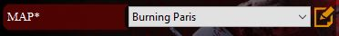

**Difficulty**: This field is mandatory if game type is not equal to Weekly, disabled in other case. To manage (add/modify/delete) Difficulty list, just click on yellow icon next to combobox item (it is analog to edit text file: AutoPlay\Docs\en\Difficulty.properties). At least one difficulty type must exist.


**Length**: This field is mandatory if game type is not equal to Weekly or Endless, disabled in other case. To manage (add/modify/delete) Length list, just click on yellow icon next to combobox item (it is analog to edit text file: AutoPlay\Docs\en\Length.properties). At least one length type must exist.


**Server name**: This field is mandatory. It must contain at least one character.


**Server password**: This field is optional

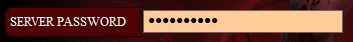

**Max. players**: This field is mandatory. To manage (add/modify/delete) Max. players list, just click on yellow icon next to combobox item (it is analog to edit text file: AutoPlay\Docs\en\MaxPlayers.properties or text file AutoPlay\Docs\en\MaxPlayersVersus.properties). At least one max.players item must exist.

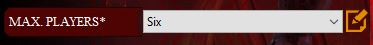

**Web admin page**: If web page check is enabled you can manage the server through it. Killing Floor 2 server must be launched before you can access web page. Web password is mandatory only is web page is enabled. Authentication:
```
User: admin
Password: <Web Password>
```

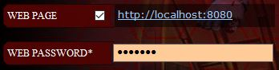

**Ports**: Ports are mandatory. You need to open ports in your router and firewall. If more than one server is launched, ports must be different between them (one profile per server configuration).

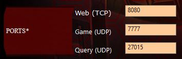

**Your clan**: This field is optional

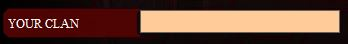

**Your web link**: This field is optional

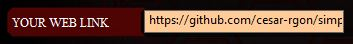

**URL image server**: This field is optional. This link must return an uploaded image to internet and it will be used as a preview image in your Killing Floor 2 server. Format and resolution must be PNG 512x256 pixels.


**Welcome message**: This field is optional. It's a welcome message in starting screen of the server.

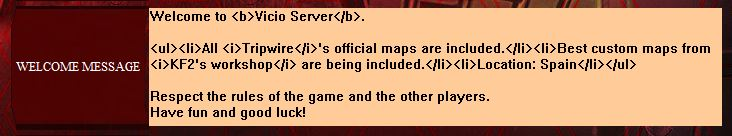

**More parameters**: This field is optional. It defines additional parameters. The format must be: parameter1=value1?parameter2=value2?...?parameterN=valueN

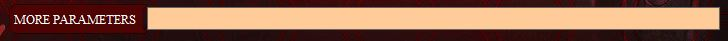

**Install server**: Install a new Killing Floor 2 server or update an existing one through SteamCmd application. You can upgrade to official versions or beta ones.


**Launch server**: Launch a Killing Floor 2 server with the specified filters. All mandatory fields must be specified.
If there is not a profile, server config files are placed in folder: KFGame\Config\\\_NoneProfile. If a profile is selected, server config files are placed in folder: KFGame\Config\PROFILENAME. So, the original config files placed in folder: KFGame\Config are never modified.

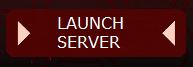

**Join server**: Join to Killing Floor 2 server game previously started. If the server has not been started, the operation will start the game but will stay in the main menu of the game. Pre-requisites: Steam application and Killing Floor 2 game must be installed. If you do not define a Game Port (UDP) will not be posible to join the server. If the server has password and join operations hasn't, will not be possible to join the server.

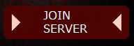

**Icon to edit PCServer-KFEngine.ini and PCServer-KFGame.ini files**: Link to edit two main config files of an Killing Floor 2 server. Useful to check server's configuration.


**Icon to open music folder**: Link to open the music folder of Killing Floor 2 server launcher. If new files are included to this folder, the launcher will play, automatically, the songs in loop and randomly.


**Icon about the author**: Link to version and author information screen of the launcher.


### Anex
#### A1. Add or remove a custom map from the launcher and the server
##### Pre-requisites
- A launcher's profile must have been created to be able to add custom maps.

##### Add a custom map to the launcher
If you add custom maps to the launcher then the launcher will automatically add the map to the Killing Floor 2 server (no need to edit server config files at all).

To add custom maps to the launcher, just follow next steps:

1) Click on yellow icon next to map's combobox item (it is analog to edit text file: "AutoPlay\Docs\profiles\YOURPROFILE\CustomMaps.properties").


2) In the text editor window add lines at the end of the file with next format:
```
KF-MapName[?idMap]=Map Description
```
- [  ] means: optional.
- KF-MapName: Mandatory. This must be exactly the map's filename without extension.
- idMap: Optional. The Steam's Workshop map identifier.
- Map Description: Mandatory. This will be displayed in combobox (whitespaces are accepted).

For example:
```
KF-BikiniAtoll?643383080=Bikini Atoll
KF-Biolapse?1258411772=Biolapse
KF-ClubConfession?1215467327=Club Confession
KF-Corridor?1208883070=Corridor
KF-Farm?960186191=Farm
KF-HorzineArena-B1-v5?711621345=Horzine Arena
KF-IceArena?642421282=Ice Arena
KF-londonRevamp?643152606=London Revamp
KF-Arid_Zedlands?1285074158=Arid Zedlands!
```
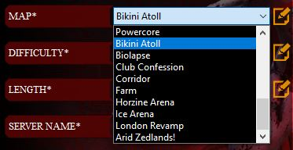

The launcher will automatically modify these files:
- KFGame\Config\YOURPROFILE\PCServer-KFEngine.ini: Adding one line per map (only for thouse maps where you define ?idMap). This action will download the custom maps when the server is launched.
- KFGame\Config\YOURPROFILE\PCServer-KFGame.ini: Adding some lines per map. This action will add the maps to map's combobox item of the server's webpage.

##### Remove a custom map of the launcher
If you remove a custom map of the launcher then the launcher will automatically remove the map from the server's config files.

To do this action:
* Click on yellow icon next to map's combobox item (it is analog to edit text file: "AutoPlay\Docs\profiles\YOURPROFILE\CustomMaps.properties").
* Remove apropiate lines and save changes.
* Start the server and the maps will be automatically removed.

#### A2. Add *Controlled Difficulty* game type to the launcher
##### Pre-requisites
* Download the file "ControlledDifficulty.u" from [this][controlled-difficulty-realeases] web page.
* Copy "ControlledDifficulty.u" file into <KF2-Server-Root\>\KFGame\BrewedPC\Script\ folder as explained in [this][controlled-difficulty-server] web page.

##### Add "Controlled Difficulty" game type to the launcher
Click on yellow icon next to game-type's combobox item (it is analog to edit text file:
"AutoPlay\Docs\en\GameTypes.properties")


and add next line at the end of the file:
```
ControlledDifficulty.CD_Survival=Controlled Difficulty
```

Optionally, add custom arguments in section "More parameters". Available arguments for Controlled Difficulty mod are described in [this][controlled-difficulty-options] web page.

For example:
```
MaxMonsters=32?WaveSizeFakes=5?SpawnCycle=basic_heavy
```

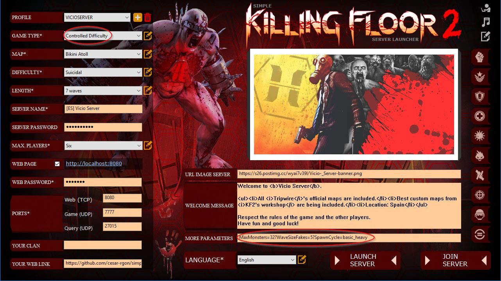

#### A3. Command line arguments
The accepted command line arguments are:
 ```
 autorun.exe --profiles PROFILENAME1 {PROFILENAME2 PROFILENAME3 ...}
```
{} means: Optional

When you specify these command line arguments, the launcher will be no interactive, that means, load and execute each profile automatically, with no need of user interaction.

For example:
```
autorun.exe --profiles MYPROFILE
```
The launcher, on startup, will load the profile MYPROFILE and execute the server automatically.

#### A4. How to execute more than one KF2 server on same computer
You need one profile per server. Each profile should contain a different server name to be identified. Further more, each profile must have different ports eachother.

For example: Two Servers on same computer
- PROFILE1: Server name: My Server 1; Ports: 8080, 7777, 27015
- PROFILE2: Server name: My Server 2; Ports: 8081, 7778, 27016

_Steps (interactive way)_:
- Start the launcher
- Load profile PROFILE1
- Launch server
- Load profile PROFILE2
- Launch server

_Steps (no interactive way)_:
- Create a shortcut with destiny:
```
autorun.exe --profiles PROFILE1 PROFILE2
```
- Execute the shortcut

#### A5. Play music when the launcher is executed
The launcher will play, on startup, music files placed in folder AutoPlay\Music. Accepted formats are: .mp3, .ogg, etc.
The music will be played in random order and in a loop.

### Author notes
I hope you can find useful this application.

By a gamer for gamers :)

<!-- References -->
[kf2serverPorts]:https://wiki.tripwireinteractive.com/index.php?title=Dedicated_Server_%28Killing_Floor_2%29#Ports
[binary-launcher]:https://github.com/cesar-rgon/simple-kf2server-launcher/raw/master/Simple-KF2server-launcher.zip
[controlled-difficulty-realeases]:https://github.com/notblackout/kf2-controlled-difficulty/releases
[controlled-difficulty-server]:https://github.com/notblackout/kf2-controlled-difficulty/blob/master/server.md
[controlled-difficulty-options]:https://github.com/notblackout/kf2-controlled-difficulty/blob/master/options.md
